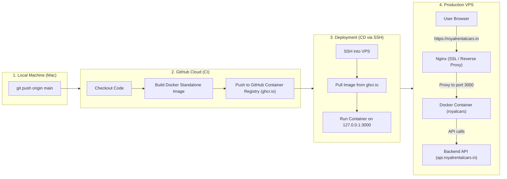

# Automated CI/CD Pipeline & Docker Deployment Guide

This document details the architecture, configuration steps, and operational workflow for the **Royal Cars Next.js** application deployed to a VPS using **Docker**, **GitHub Container Registry (GHCR)**, **GitHub Actions**, and an **Nginx Reverse Proxy** with SSL.

---

## 1. System Architecture



---

## 2. Core Concepts

### A. Docker & Next.js Standalone
* **Docker Container:** Encapsulates the application, runtime (Node.js), and exact dependencies into an immutable image that runs identically in development and production.
* **Next.js Standalone Mode (`output: "standalone"`):** Traces only the specific files and node modules required by your code. Instead of copying a 500MB+ `node_modules` folder, it generates a minimal `server.js` output (~80–120MB), drastically reducing image size and memory footprint.

### B. CI/CD (Continuous Integration & Continuous Deployment)
* **Continuous Integration (CI):** When code is pushed to `main`, GitHub Actions automatically builds the Docker image in GitHub's cloud environment. This offloads CPU and memory usage from your VPS.
* **Continuous Deployment (CD):** Once built, GitHub Actions securely connects to your VPS via SSH, pulls the latest image from GHCR, replaces the old container, and starts the new one with zero manual intervention.

---

## 3. Configuration Breakdown

### 1. `next.config.ts` (Standalone & Rewrites)
Enables standalone compilation and defines proxy rewrites for backend API routes:

```typescript
import type { NextConfig } from "next";

const nextConfig: NextConfig = {
  output: "standalone",
  async rewrites() {
    return [
      {
        source: "/api/:path*",
        destination: `${process.env.BACKEND_INTERNAL_URL || "https://api.royalrentalcars.in"}/api/:path*`,
      },
    ];
  },
  images: {
    remotePatterns: [
      { protocol: "https", hostname: "images.unsplash.com" },
      { protocol: "https", hostname: "images.pexels.com" },
      { protocol: "https", hostname: "res.cloudinary.com" },
      { protocol: "https", hostname: "plus.unsplash.com" },
      { protocol: "https", hostname: "pub-6e164401844e42a18bdff5533ec36d1f.r2.dev" },
    ],
  },
};

export default nextConfig;
```

### 2. Multi-Stage `Dockerfile`
Optimized 3-stage build using Bun for dependency resolution and compilation, and a lightweight Node Alpine image for runtime:

```dockerfile
# 1. Install dependencies
FROM oven/bun:1-alpine AS deps
WORKDIR /app
COPY package.json bun.lock ./
RUN bun install --frozen-lockfile

# 2. Build the app
FROM oven/bun:1-alpine AS builder
WORKDIR /app
COPY --from=deps /app/node_modules ./node_modules
COPY . .
ARG BACKEND_INTERNAL_URL="https://api.royalrentalcars.in"
ENV BACKEND_INTERNAL_URL=$BACKEND_INTERNAL_URL
ENV NEXT_TELEMETRY_DISABLED=1
ENV NODE_ENV=production
RUN bun run build

# 3. Production runner
FROM node:20-alpine AS runner
WORKDIR /app

ENV NODE_ENV=production
ENV PORT=3000
ENV HOSTNAME="0.0.0.0"

RUN addgroup --system --gid 1001 nodejs && \
    adduser --system --uid 1001 nextjs

COPY --from=builder /app/public ./public
COPY --from=builder --chown=nextjs:nodejs /app/.next/standalone ./
COPY --from=builder --chown=nextjs:nodejs /app/.next/static ./.next/static

USER nextjs

EXPOSE 3000

CMD ["node", "server.js"]
```

### 3. `.dockerignore`
Prevents local builds, dependencies, and environment secrets from being included in the Docker build context:

```text
node_modules
.next
.git
.env*
Dockerfile
README.md
```

### 4. GitHub Actions Workflow (`.github/workflows/deploy.yml`)

```yaml
name: Build and Deploy

on:
  push:
    branches:
      - main

env:
  REGISTRY: ghcr.io
  IMAGE_NAME: ${{ github.repository }}

jobs:
  build-and-push:
    runs-on: ubuntu-latest
    permissions:
      contents: read
      packages: write

    steps:
      - name: Checkout repository
        uses: actions/checkout@v4

      - name: Set up Docker Buildx
        uses: docker/setup-buildx-action@v3

      - name: Log in to GitHub Container Registry
        uses: docker/login-action@v3
        with:
          registry: ${{ env.REGISTRY }}
          username: ${{ github.actor }}
          password: ${{ secrets.GITHUB_TOKEN }}

      - name: Downcase IMAGE_NAME
        run: |
          echo "IMAGE_NAME_LOWER=$(echo '${{ env.IMAGE_NAME }}' | tr '[:upper:]' '[:lower:]')" >> $GITHUB_ENV

      - name: Build and push Docker image
        uses: docker/build-push-action@v5
        with:
          context: .
          push: true
          tags: ${{ env.REGISTRY }}/${{ env.IMAGE_NAME_LOWER }}:latest
          cache-from: type=gha
          cache-to: type=gha,mode=max

  deploy:
    needs: build-and-push
    runs-on: ubuntu-latest

    steps:
      - name: Deploy to VPS via SSH
        uses: appleboy/ssh-action@v1.0.3
        with:
          host: ${{ secrets.VPS_HOST }}
          username: ${{ secrets.VPS_USER }}
          key: ${{ secrets.VPS_SSH_KEY }}
          port: 22
          timeout: 60s
          script: |
            echo "${{ secrets.CR_PAT }}" | docker login ghcr.io -u ${{ github.actor }} --password-stdin
            
            IMAGE=ghcr.io/$(echo '${{ env.IMAGE_NAME }}' | tr '[:upper:]' '[:lower:]'):latest
            
            # Pull latest image
            docker pull $IMAGE
            
            # Stop and remove existing container if running
            docker stop royalcars || true
            docker rm royalcars || true
            
            # Run new container
            docker run -d \
              --name royalcars \
              --restart unless-stopped \
              -p 127.0.0.1:3000:3000 \
              --env-file /home/sanil/royalcars/.env \
              $IMAGE
            
            # Clean up old unused images
            docker image prune -af --filter "until=24h"
```

### 5. Nginx Reverse Proxy Configuration
File on VPS: `/etc/nginx/sites-available/royal-cars-client`

```nginx
server {
    server_name royalrentalcars.in www.royalrentalcars.in;

    client_max_body_size 25M;

    # Gzip compression
    gzip on;
    gzip_proxied any;
    gzip_types text/plain text/css application/json application/javascript text/xml application/xml application/xml+rss text/javascript image/svg+xml;

    # Cache Next.js static files
    location /_next/static {
        proxy_pass http://127.0.0.1:3000;
        proxy_cache_bypass $http_upgrade;
        expires 365d;
        access_log off;
    }

    # Reverse proxy to Next.js running on port 3000
    location / {
        proxy_pass http://127.0.0.1:3000;
        proxy_http_version 1.1;

        proxy_set_header Upgrade $http_upgrade;
        proxy_set_header Connection "upgrade";

        proxy_set_header Host $host;
        proxy_set_header X-Real-IP $remote_addr;
        proxy_set_header X-Forwarded-For $proxy_add_x_forwarded_for;
        proxy_set_header X-Forwarded-Proto $scheme;

        proxy_connect_timeout 60s;
        proxy_send_timeout 60s;
        proxy_read_timeout 60s;
    }

    # SSL configuration managed by Certbot
    listen 443 ssl;
    ssl_certificate /etc/letsencrypt/live/royalrentalcars.in/fullchain.pem;
    ssl_certificate_key /etc/letsencrypt/live/royalrentalcars.in/privkey.pem;
    include /etc/letsencrypt/options-ssl-nginx.conf;
    ssl_dhparam /etc/letsencrypt/ssl-dhparams.pem;
}

server {
    if ($host = www.royalrentalcars.in) {
        return 301 https://$host$request_uri;
    }
    if ($host = royalrentalcars.in) {
        return 301 https://$host$request_uri;
    }

    listen 80;
    server_name royalrentalcars.in www.royalrentalcars.in;
    return 404;
}
```

---

## 4. Troubleshooting & Key Learnings

| Issue | Root Cause | Solution |
| :--- | :--- | :--- |
| **PM2 reported ~7.5 MB RAM** | PM2 was started with `bun start`. PM2 tracked the Bun CLI launcher process instead of the spawned Next.js server child process. | Replaced PM2 process runner with a direct standalone Docker container. |
| **Nginx `conflicting server name` on port 80** | Both `royal-cars-client` and `royalcars` defined the same domain on port 80. | Removed duplicate `/etc/nginx/sites-enabled/royalcars` and upgraded `royal-cars-client` to keep existing SSL certificates. |
| **SSH `dial tcp ...:22: i/o timeout`** | GitHub Actions runner could not reach port 22 due to firewall drop or invalid host string. | Ensured `VPS_HOST` contained strictly the IP (`200.234.38.63`) without protocols or prefixes, and verified port 22 was open. |
| **SSH `handshake failed: attempted methods [none]`** | SSH private key was invalid, formatted incorrectly, or the public key was entered instead. | Generated a dedicated, passphrase-less `ed25519` key pair on the VPS and stored the private key in `VPS_SSH_KEY`. |
| **`ECONNREFUSED 127.0.0.1:8000` on API calls** | Next.js pre-compiles `rewrites` into `routes-manifest.json` **at build time**. `127.0.0.1` inside a Docker container refers to the container itself, not the VPS host. | Set default fallback in `next.config.ts`, `api.ts`, and Docker build args to `https://api.royalrentalcars.in`. |

---

## 5. Daily Development Workflow

1. **Make changes & test locally:**
   ```bash
   bun dev
   ```
2. **Commit and push to GitHub:**
   ```bash
   git add .
   git commit -m "feat: your new feature"
   git push origin main
   ```
3. **Automated Execution:**
   - GitHub Actions triggers automatically.
   - Builds the standalone container image in the cloud.
   - Pushes to `ghcr.io`.
   - Connects to VPS over SSH and updates the `royalcars` container.
   - Nginx handles incoming SSL requests and proxies directly to the live app.
